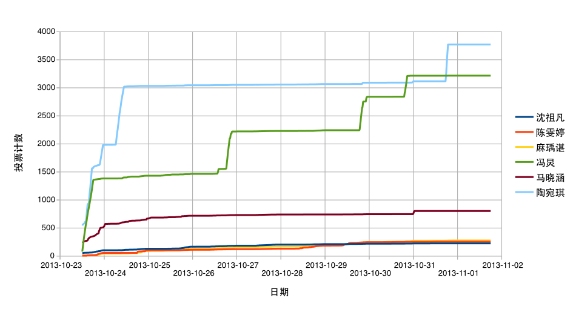

ahmasez-vote-analyzer
=====================

Analyzes vote on ahmasez.cn

Ahmasez.cn 投票分析器

Notice 注意
-----------

This program can only analyze vote on ahmasez.cn, not any other sites.

本程序只分析 ahmasez.cn 的投票结果，不分析其它站点。

This program gets vote result to make a chart and DOES NOT affect vote.

本程序获取投票结果，**不会改变投票结果**。得到的数据可以用来制表。

Setup 安装
----------

This program requires a POSIX environment to run. (Cygwin will also do.)

本程序需要 POSIX 环境来运行。（Cygwin 模拟也可以。）

Dependencies:

依赖：

- Bash
- Python (>=3.0)
- cURL

Usage 用法
----------

`crawl.sh` fetches the vote result every ten minutes. While `analysis.py` analysises these results and output a `output.csv` file.

`crawl.sh`每十分钟获取一次投票结果，而`analysis.py`分析投票结果并导出`output.csv`文件。

`output.csv` file can be imported into Microsoft Office Excel or LibreOffice Calc.

`output.csv`文件可以导入到 Microsoft Office Excel 或 LibreOffice Calc。

Forum Thread 帖子
-----------------

See the forum thread here:

在此处看帖子：

[http://tieba.baidu.com/p/2668066997](http://tieba.baidu.com/p/2668066997 "用统计学方法分析校助刷票事件")

Chart 图表
------------

For the `csv` file, see [bonus/output.csv](bonus/output.csv) .

移步 [bonus/output.csv](bonus/output.csv) 来查看`csv`表格。

License 版权许可
----------------

This program is released under General Public License 3.0. No one is permitted to use this program commercially.

本程序遵循通用公共许可证3.0发布。谢绝用作商业用途。

This program comes with absolutely NO WARRANTY. Abusing this program might cause lossless. Please be responsible for all you do on your own.

本程序**不提供任何担保**，不当地使用本程序可能造成损害，请对您所做一切负责。

